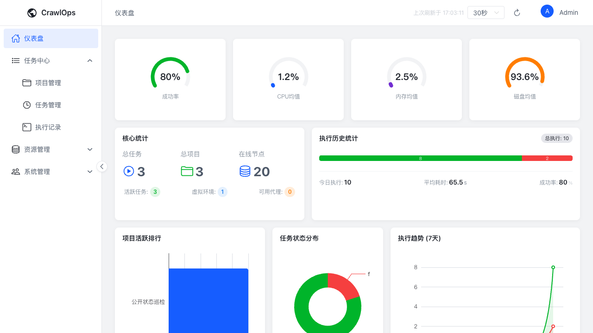
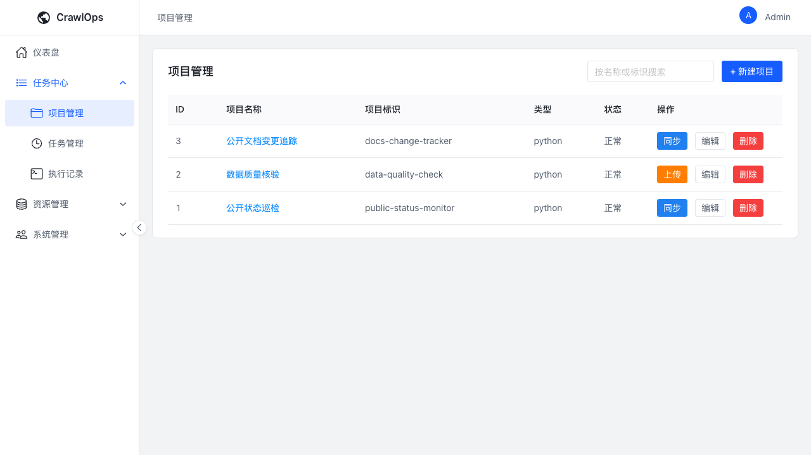
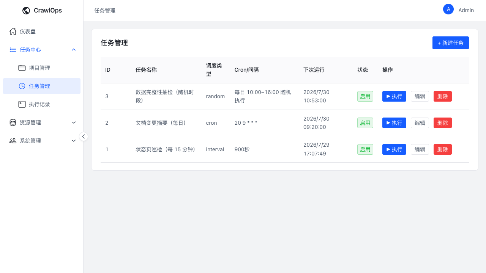
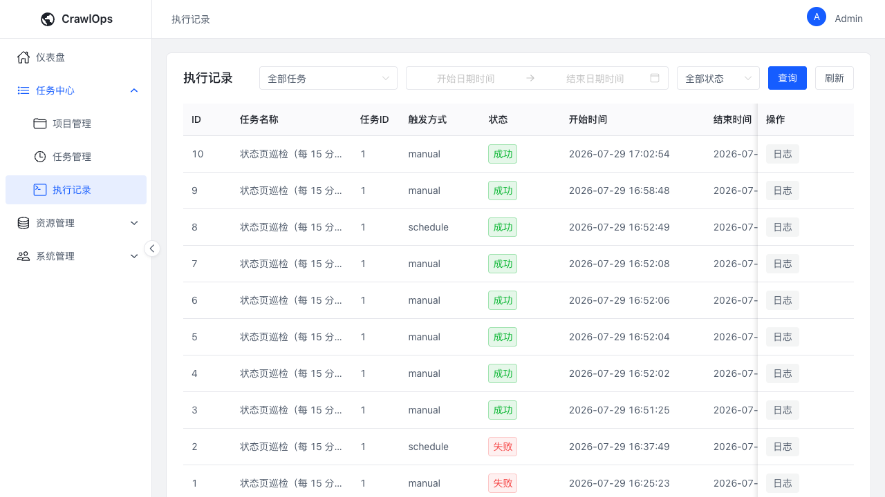
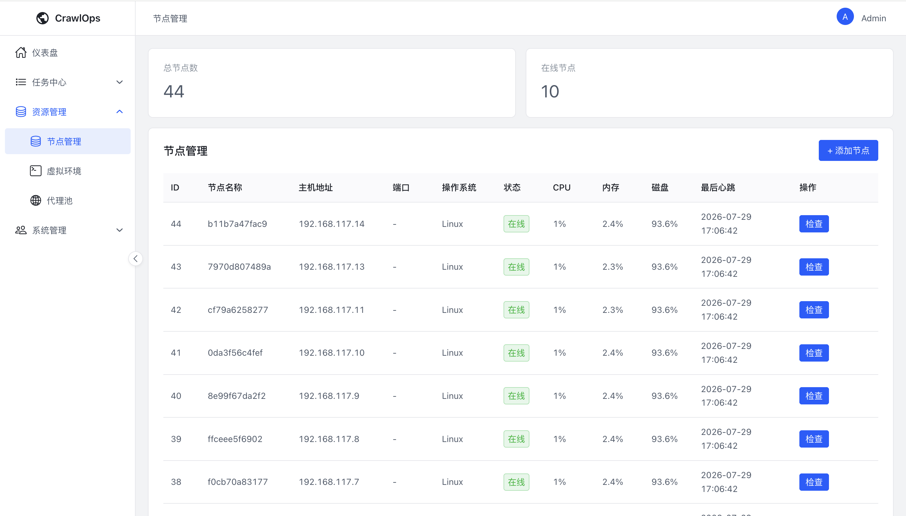
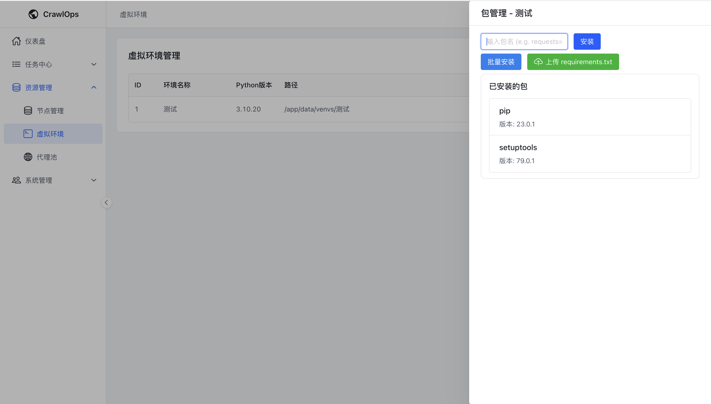
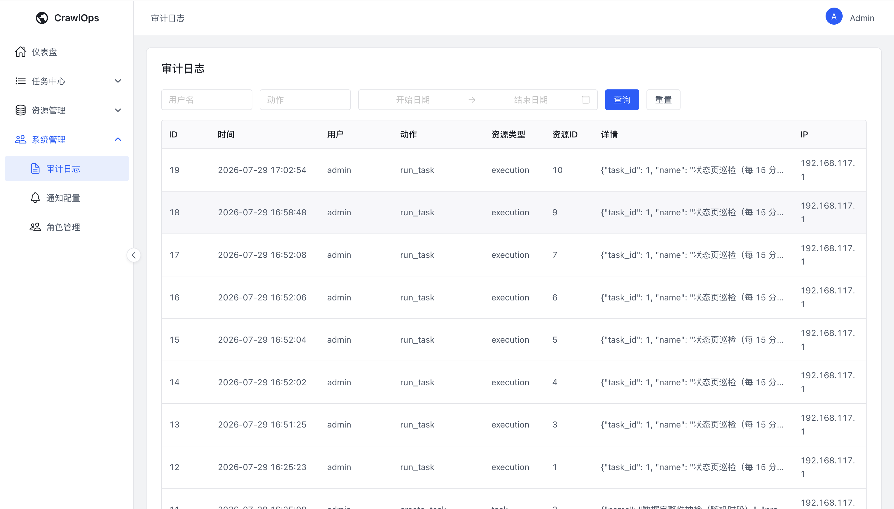
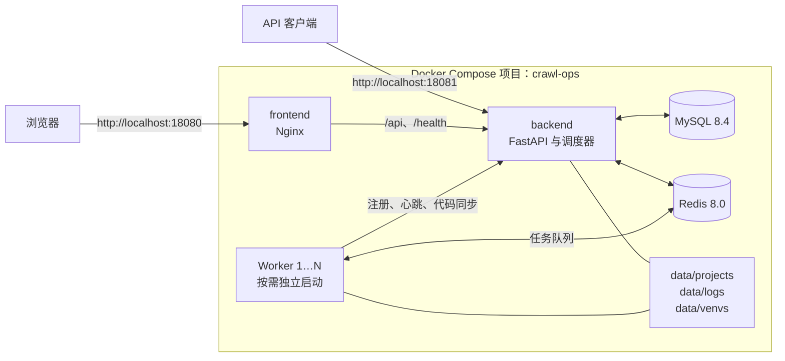

# CrawlOps

CrawlOps 是一个面向团队的分布式采集与自动化任务控制平台。它将项目代码、任务调度、Worker 节点、执行记录、运行环境和审计日志集中到同一个控制台，方便在多台机器上稳定运行和管理自有任务。

适合需要统一调度、分发和追踪 Python 采集或自动化脚本的团队。

> CrawlOps 仅应用于已获授权的系统、代码和数据。详见[使用限制与合规要求](docs/RESPONSIBLE_USE.md)。

## 功能概览

| 领域 | 能力 |
| --- | --- |
| 项目与代码 | 上传项目代码或关联 Git 仓库；管理项目运行入口和代码同步。 |
| 任务调度 | 支持 Cron、固定间隔、随机时段、指定时间和手动触发。 |
| 分布式执行 | Worker 自动注册、定期心跳、任务分发和代码同步；可按需启动多个实例。 |
| 可观测性 | 查看执行状态、日志、耗时、退出码，以及节点的 CPU、内存、磁盘和心跳。 |
| 运行环境 | 为任务创建 Python 虚拟环境，并在控制台管理依赖包。 |
| 管理与审计 | 配置通知渠道、角色权限和操作审计；代理外部采集默认关闭。 |

## 界面预览

以下页面来自 Docker Compose 演示环境，包含示例项目、三类调度任务和多个真实 Worker 节点。截图不包含第三方业务数据或密钥。

### 任务概览



### 项目、调度与执行记录

| 项目管理 | 任务管理 |
| --- | --- |
|  |  |



### 资源与治理

| 节点管理 | 虚拟环境依赖管理 |
| --- | --- |
|  |  |



## 架构



基础设施和控制台定义在 `docker-compose.yml`；Worker 定义在 `docker-compose.worker.yml`。两者使用同一个 Compose 项目，因此 Worker 可以独立扩缩容。

## 快速开始

### 环境要求

- Docker Engine
- Docker Compose v2

### 1. 获取代码并配置密钥

```bash
git clone https://github.com/huozhicheng/crawl-ops.git
cd crawl-ops
cp .env.example .env
```

`.env` 仅保存两个私密值：

```dotenv
MYSQL_ROOT_PASSWORD=
REDIS_PASSWORD=
```

请使用独立的高强度密码，并且不要提交 `.env`。MySQL 不创建额外的业务数据库账号；后端使用 `root` 连接 `crawlops` 数据库。

### 2. 启动基础设施和控制台

```bash
docker compose up --build -d
```

该命令启动 MySQL、Redis、后端和前端控制台，不会启动 Worker。

### 3. 按需启动 Worker

启动一个 Worker：

```bash
docker compose -f docker-compose.worker.yml up -d
```

启动三个 Worker：

```bash
docker compose -f docker-compose.worker.yml up -d --scale worker=3
```

`--scale worker=N` 会将实例数调整为 `N`。每个实例会作为独立节点注册到控制台。

> 单独使用 Worker Compose 文件时，Docker 可能提示基础服务是 orphan containers。这是因为基础服务没有定义在该文件中，不影响已运行的服务；不要在该命令中使用 `--remove-orphans`。

### 4. 登录控制台

- 控制台：<http://localhost:18080>
- 后端 API：<http://localhost:18081>
- OpenAPI 文档：<http://localhost:18081/docs>
- 初始账号：`admin`
- 初始密码：`123456`

`init.sql` 会在 MySQL 数据卷首次初始化时创建默认管理员并授予超级管理员角色。首次登录后应立即修改密码；已有数据卷不会重置账号或密码。

## 配置参考

| 配置项 | 位置 | 说明 |
| --- | --- | --- |
| `MYSQL_ROOT_PASSWORD` | `.env` | MySQL root 密码，也是后端连接数据库使用的密码。 |
| `REDIS_PASSWORD` | `.env` | Redis 访问密码。 |
| `127.0.0.1:18080` | `docker-compose.yml` | 前端控制台端口，仅绑定本机。 |
| `127.0.0.1:18081` | `docker-compose.yml` | 后端 API 端口，仅绑定本机。 |
| `WORKER_REGISTRATION_TOKEN` | 两份 Compose 文件 | Worker 首次注册的共享令牌；两个文件中的值必须一致。 |

MySQL、Redis 和 Worker 未映射宿主机端口。生产部署应在反向代理层配置 TLS 和访问控制，并通过私有网络或 VPN 连接 Worker。

## 日常运维

查看基础服务状态和日志：

```bash
docker compose ps
docker compose logs -f
```

查看 Worker 状态和日志：

```bash
docker compose -f docker-compose.worker.yml ps
docker compose -f docker-compose.worker.yml logs -f
```

停止 Worker：

```bash
docker compose -f docker-compose.worker.yml stop
```

停止全部服务并保留数据：

```bash
docker compose -f docker-compose.yml -f docker-compose.worker.yml down
```

MySQL 和 Redis 使用命名数据卷保存数据；项目代码、执行日志和虚拟环境分别位于 `data/projects`、`data/logs` 和 `data/venvs`。

## 本地开发

后端开发需要可访问的 MySQL 和 Redis，并设置 `DATABASE_URL` 和 `REDIS_URL`：

```bash
cd backend
poetry install
poetry run uvicorn main:app --reload
poetry run pytest
```

前端开发：

```bash
cd frontend
pnpm install
pnpm dev
pnpm build
```

## 安全与合规

CrawlOps 可以管理并执行任务代码，不应直接暴露给不可信用户或公网。请仅执行经过审核的任务代码，并保护数据库、Redis、Worker 注册令牌和运行日志。

- [使用限制与合规要求](docs/RESPONSIBLE_USE.md)
- [安全漏洞报告](SECURITY.md)

## 贡献

欢迎提交 issue 和 pull request。提交前请阅读[贡献指南](CONTRIBUTING.md)，并确保不提交密钥、运行数据或未经授权的第三方内容。

## 许可证

[MIT](LICENSE)
