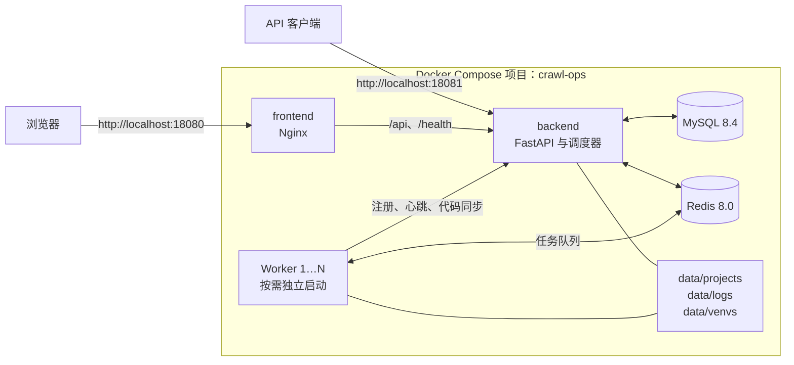

# CrawlOps

CrawlOps 是面向团队的分布式采集任务控制与运行管理平台。它将项目代码、任务调度、Worker 节点、执行记录、运行环境和通知配置集中到一个管理界面中。

适用于需要在多台机器上运行自有采集或自动化任务，并希望统一管理任务状态、日志与节点资源的团队。

> CrawlOps 只应用于已获授权的系统、代码和数据。使用限制见[使用限制与合规要求](docs/RESPONSIBLE_USE.md)。

## 功能

- 项目管理：上传项目代码或关联 Git 仓库，管理项目版本与运行入口。
- 任务调度：支持 Cron、固定间隔、随机时段、指定时间和手动触发。
- 分布式执行：Worker 自动注册、心跳上报、任务分发与代码同步。
- 执行记录：查看任务状态、执行日志、耗时、退出码和错误信息。
- 节点管理：查看 Worker 节点的在线状态、CPU、内存、磁盘和心跳时间。
- 运行环境：为任务创建和管理 Python 虚拟环境。
- 通知与审计：配置通知渠道，记录登录和管理操作。
- 代理管理：维护代理记录、连通性和评分；外部代理源采集默认关闭。

## 服务组成

| 服务 | 作用 | 宿主机访问 |
| --- | --- | --- |
| frontend | Web 管理界面与 API 反向代理 | `http://localhost:18080` |
| backend | 管理 API、调度器与任务控制服务 | `http://localhost:18081` |
| worker | 按需启动的任务执行进程，向后端上报状态 | 仅 Compose 网络 |
| db | MySQL 8.4，保存业务数据 | 仅 Compose 网络 |
| redis | Redis 8.0-alpine，保存登录令牌和任务队列数据 | 仅 Compose 网络 |

基础设施与控制台定义在 `docker-compose.yml` 中；Worker 定义在 `docker-compose.worker.yml` 中。Worker 启动时与基础服务加入同一个 `crawl-ops` Compose 项目，可按需运行多个实例。

## 架构



## 快速开始

### 环境要求

- Docker Engine
- Docker Compose v2

### 1. 获取代码并配置密钥

```bash
git clone https://github.com/huozhicheng/crawl-ops.git
cd crawl-ops
cp .env.example .env
```

编辑 `.env`，填写两个私密值：

```dotenv
MYSQL_ROOT_PASSWORD=
REDIS_PASSWORD=
```

MySQL 不创建额外的业务数据库账号；后端使用内置 `root` 账号连接 `crawlops` 数据库。请为两个密码设置独立的高强度值，且不要提交 `.env`。

### 2. 启动基础设施与控制台

```bash
docker compose up --build -d
```

该命令启动 MySQL、Redis、后端和前端控制台，不启动 Worker。

### 3. 启动 Worker

启动一个 Worker：

```bash
docker compose -f docker-compose.worker.yml up -d
```

启动三个 Worker：

```bash
docker compose -f docker-compose.worker.yml up -d --scale worker=3
```

`--scale worker=N` 会将 Worker 实例数调整为 `N`。每个实例使用独立的容器名称与主机名，并作为独立节点注册到控制台。

单独执行 Worker 文件时，Docker Compose 可能提示基础服务是 orphan containers；这是因为基础服务不在该文件中定义，不影响正在运行的服务。不要在此命令中使用 `--remove-orphans`。

### 4. 登录控制台

- 控制台：<http://localhost:18080>
- 后端 API：<http://localhost:18081>
- OpenAPI 文档：<http://localhost:18081/docs>
- 初始账号：`admin`
- 初始密码：`123456`

`init.sql` 会在 MySQL 数据卷首次初始化时创建默认管理员并授予超级管理员角色。首次登录后应立即修改密码。

## 配置参考

| 配置项 | 位置 | 说明 |
| --- | --- | --- |
| `MYSQL_ROOT_PASSWORD` | `.env` | MySQL root 密码，也是后端连接数据库使用的密码。 |
| `REDIS_PASSWORD` | `.env` | Redis 访问密码。 |
| `127.0.0.1:18080` | `docker-compose.yml` | 前端控制台端口。 |
| `127.0.0.1:18081` | `docker-compose.yml` | 后端 API 端口。 |
| `crawlops-local-worker` | 两份 Compose 文件 | Worker 首次注册时使用的内部共享令牌。 |

MySQL、Redis 和 Worker 未映射到宿主机端口。前端与后端端口仅绑定到本机回环地址。

## 数据与运行

- MySQL 数据保存在 `mysql_data` 命名数据卷中。
- Redis 数据保存在 `redis_data` 命名数据卷中。
- 项目代码、执行日志和虚拟环境分别挂载到 `data/projects`、`data/logs` 和 `data/venvs`。

查看基础服务状态：

```bash
docker compose ps
docker compose logs -f
```

查看 Worker 状态与日志：

```bash
docker compose -f docker-compose.worker.yml ps
docker compose -f docker-compose.worker.yml logs -f
```

停止 Worker：

```bash
docker compose -f docker-compose.worker.yml stop
```

停止所有服务但保留数据：

```bash
docker compose -f docker-compose.yml -f docker-compose.worker.yml down
```

## 本地开发

后端开发需要可访问的 MySQL 和 Redis，并设置 `DATABASE_URL`、`REDIS_URL`。

```bash
cd backend
poetry install
poetry run uvicorn main:app --reload
poetry run pytest
```

前端开发：

```bash
cd frontend
pnpm install
pnpm dev
pnpm build
```

## 安全与合规

CrawlOps 可以管理并执行任务代码，不应直接暴露给不可信用户或公网。部署到生产环境时，应在反向代理层配置 TLS 与访问控制，并使用受信任的私有网络或 VPN 连接 Worker。

- [使用限制与合规要求](docs/RESPONSIBLE_USE.md)
- [安全漏洞报告](SECURITY.md)

## 贡献

欢迎提交 issue 和 pull request。提交前请阅读[贡献指南](CONTRIBUTING.md)，并确保不提交密钥、运行数据或未经授权的第三方内容。

## 许可证

[MIT](LICENSE)
